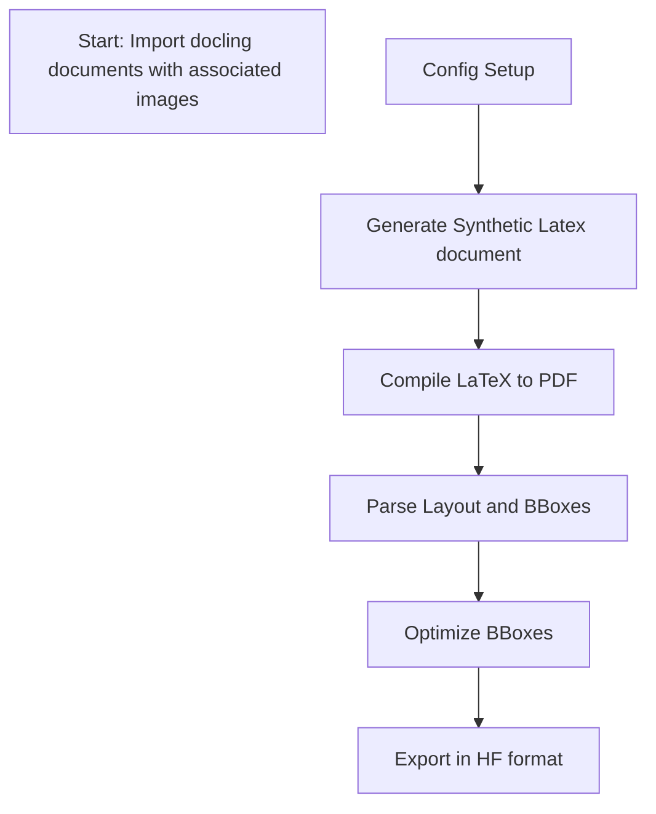

# 📦 Pipeline Overview

This project transforms LaTeX source documents into structured, annotated data suitable for machine learning tasks. The pipeline includes synthetic data generation, layout parsing, annotation, and export to Hugging Face dataset format.

---

## 🗺️ High-Level Workflow



## Starting Point A
The dataset expect a docling document with name ``` filename.json``` and the images referenced in that file as ```file_name_pictures_[picture number]```.
An example is 3246478299440331.json and 3246478299440331_pictures_0.png. A suggestion is to use the hash number as the file name.

An example on how to export the document in this format can be found in ```synthetic_data_generator/pipeline_from_tex_to_seed_doc/arxiv_html_to_docling.py``` at line 462:
```python
 if isinstance(element, PictureItem):
    picture_counter += 1
    ref = element.self_ref.split('/')
    element_image_filename = (
        output_dir / f"{file_name_hash}_{ref[1]}_{ref[2]}.png"
    )
    with element_image_filename.open("wb") as fp:
        element.get_image(doc).save(fp, "PNG",dpi = (150, 150))
```

This file must be put under ```dataset/name_dataset``` and the config.json file modified accordingly (change the seed data origin).

## B Config setup
Under [Config Overview](configuration.md) you can find an overview of the different file in this repo to change some parameters of the generation.
In particular, starting from ```config/config.json```:

#### Dataset Path

By default, the SDG looks for the source data in the directory ```/synthetic_data_generation/dataset/```. If you store your data in this directory, you do not need to provide a data path. Otherwise, the path to the source data must be specified using the following key/value pair.

```
"dataset-path": ""
```

#### Document Indexes

You can select the documents that are picked for the synthetic data generation process. The directory you point the SDG to with the value provided for the key *dataset-path* entails the origin data based on which the synthetic data is gnerated. By providing values to the keys *document-start-index* and *document-end-index*, you can select the range of origin documents picked for the synthesis. This comes in handy, if multiple SDG processes are started (e.g. on a cluster), as the first job could take indexes 1 ... 999, the second job could take indexes 1000 ... 1999, etc. If the start index is not provided, it is set to zero by default. In case the finish index is not provided, it is set equal to the number of documents stored in the dataset directory, i.e. all documents from start to the end are used for synthesis.

##### Example

```
...
"document-start-index: 0,
"document-finish-index: 999,
...
```

##### Documents with tables
Set only_documents_with_tables to take only seed documents with tables inside (usefull when you want to generate synthetic document with charts, as the charts are created from tables).

##### cutoff_date
If you want to filter all the documents processed before the cutoff date. For example, if I stop the generation and I want to start again after some days, I can filter the seed documents for which I generated a syn document before the cutoff date.

#### Stored Files

Several temporary files are created during the process of generating the synthetic dataset. Some of these temporary files are necessary to generate the synthesized PDF document, others are just log files containing information about the PDF generation steps. The *stored-files* option allows you to decide which files to save. The generation of particular output files can be truned on/off by providing the according boolean flag *true/false* as value.

- **pdf**: The compiled LaTeX code in PDF format.
- **tex**: The tex code.
- **aux**: Created by default by LaTeX during the PDF generation process; entails metadata about the compilation.
- **log**: Created by default by LaTeX during the PDF generation process; entails detailed information about all steps-taken during the compilation step alongside info, warning, and error messages.
- **pos**: An array of temporary files containing position logs of specific items rendered in the PDF document. The data stored in these file is ultimately used by the SDG to compute GT data. Setting this value to true keeps all position log files.
- **vis**: This flag ensures that all files that are required for the visualiation through the ```reading_order_visualizer.py``` are generated. This flag currently generates the docling document used as a GT.

*Tip: If you intend to generate large datasets, it is recommended to set all values adside pdf and vis to 'false'. The generation of all such files consumes a considerable amount of memory!*

###### Example

```
"stored-files": {
  "pdf": false, // (bool)
  "tex": true // (bool)
  "aux": false, // (bool)
  "log": false, // (bool)
  "pos": true, // (bool)
  "vis": true, // (bool)
}
```

#### Document Selection

The SDG provides three different ways to select documents that serve as source data for synthesizing new documents. These new documents are variants of the source document that differ in style and content based on the templates used for synthesis. Only one option can be selected. If multiple options are provided, any one of them could be used by the SDG (undefined behavior). If no options or only non-existent options are provided, the SDG uses *all* by default. The available options are described below.

- **all**: Synthethic data is generated for every document of the source dataset.
```
"document-selection": {
  "all": {} // The value for this key is ignored.
}
```
- **custom**: Synthetic data is generated only for documents whose file names are explicitly provided. This option allows you to synthesize data only from a custom subset of documents in your source dataset.
```
"document-selection": {
  "custom": {
    "document-file-names": [
      "<file_name_0>.<file_extension_0>",
      "<file_name_1>.<file_extension_1>",
      ...,
      "<file_name_n>.<file_extension_n>"
    ]
  }
}
```
- **random**: Synthetic documents are only generated for a random sample of documents selected from the source dataset. No document is sampled more than once. The sample size can be configured as shown below.
```
"document-selection": {
  "random": {
    "num-to-select": <num_to_select> // (int) A number >= 0
  }
}
```

#### Template Selection

Once the source documents for synthetization are selected, the templates to create synthesized variants of the source document must be selected. The source document provides the data for the synthesis, whereas the template provides the styling of the synthetic document. Think of styling as the configuration of font styles, font sizes, page margins, elements to be displayed (e.g. switch on/off figures, captions, tables, etc.). Therefore, each template is a unique way of determining the style of the synthesized document.

Templates can be selected from three different categories: *official*, *internal*, and *personal* (see the *Template Storage System* section for differences). You can provide templates from all three categories for the same synthesizing process, as you might want to synthesize documents from official sources (e.g. Overleaf), templates provided by the SDG, and your personal (custom) ones. The base layout of the *template-selection* ought to look as the following example:

```
"template-selection": {
  "official": {
  },
  "internal": {
  },
  "personal": {
  }
}
```

---

As a next step, the templates to use for synthesis must be specified for each of the three categories explained above. You can choose between three different options: *all*, *custom*, and *random*. If no option is specified, *all* is selected by default.

Each template can be used multiple times to synthesize data from the same source document. This can be useful if a template uses a randomized selection for multiple style options, resulting in a different document style on every run. This behaviour can be configured by specifying a value for the *num-instances* key. For instance, setting *num_instances = 2* creates two synthesized version of the origin document using the specified template.

Another option to randomize the template selection can be specified via the *num-to-shuffle* value. This value defines how many templates of the selected templates are actually used for data synthesis. Think of this setting as follows: Each of *all*, *custom*, and *random* allows you to select templates from a respective category. *num-to-shuffle* is then used to select a subset of these templates. Why is this useful? E.g. if you want to specify a pool of several templates used for data synthesis, but you only want to generate one synthesized document for each origin document, then setting *num-to-shuffle = 1* provides you exactly with this functionality. Only one template from your selected pool of templates is sampled randomly and used for synthesizing the document. The value provided for *num-to-shuffle* must be greater than zero; otherwise, it is ignored and all selected templates are used for synthesis. Setting a value greater than the selected number of templates, simply results in picking all the selected templates.

- **all**: All templates of the category this option belongs to are selected for data synthesis, i.e. each template will be used at least once to generate a new variant of each selected source document.
```
"<template_type>": {
  "all": {
    "num-instances": <num_instances>, // (int)
    "num-to-shuffle": <num_to_shuffle> // (int)
  }
}
```
- **custom**: Allows to select a subset of templates used for data synthesis.
```
"<template_type>": {
  "custom": {
    "template-names": [
      "<template_name_1>.json",
      "<template_name_2>.json",
      ...,
      "<template_name_n>.json",
    ],
    "num-instances": <num_instances>, // (int)
    "num-to-shuffle": <num_to_shuffle> // (int)
  }
}
```
- **random**: Allows a random selection of templates used for data synthesis. No template is selected more than once.
```
"<template_type>": {
  "random": {
    "num-to-select": <num_to_select>, // (int)
    "num-instances": <num_instance>, // (int)
    "num-to-shuffle": <num_to_shuffle> // (int)
  }
}
```

###### Complete examples

###### Example 1

```
{
  "dataset-path": "/path/to/my/source/dataset/",
  "document-start-index: 0,
  "document-finish-index: 999,
  "stored-files": {
    "log": true,
    "pdf": true
  },
  "document-selection": {
    "all": {}
  },
  "template-selection": {
    "internal": {
      "custom": [
        {
          "template-name": "my_template.json",
          "num-instances": 1
        },
        {
          "template-name": "my_other_template.json",
          "num-instances": 2
        }
      ]
    },
    "personal": {
      "all": {
        "num-instances": 1
      }
    }
  }
}
```

###### Example 2

```
{
  "document-start-index: 10,
  "document-selection": {
    "random": {
      "num-to-select": 12
    }
  },
  "template-selection": {
    "official": {
        "all": {}
    }
  }
}
```
<br>


### Chart generation
The flag ``` "chart-flag"  ``` must set to True inside ```synthetic_data_generation/templates/template_settings/layout_settings/base_layout_style.json ```.
By default the charts available are Pie, Bar, StackedBar and are choosen randomly. (As Stacked bar requires more parameters, if the generation fails, the other two are tried instead).
The style of the charts can be modified in the original repo.
In addition if you want you generate charts you need to clone the repo https://github.ibm.com/DeepSearch/chart-rendering/tree/dev/syn_data_adaptation and put it at the same level of `config`.

## C -> F Generate the synthetic document
To run this application, execute the following Python scripts from the root directory:

* For general synthetic data generation:

  ```bash
  poetry run python3 synthetic_data_generator.py -e <production|dev>
  ```

  Use `dev` for development: the script will stop on errors.
  Use `production` to catch and log errors to a file, then continue processing the next document.

* For large-scale data generation (recommended workflow):

  ```bash
  poetry run python3 synthetic_data_generator_parallel.py -e <production|dev>
  ```

  In this parallel version, each document is attempted up to **three times** before being marked as a failure (see line 77 in `synthetic_data_generator_parallel.py`).

---

### Document Generation Workflow

For each input file:

1. A list of templates is selected.
2. A specified number of instances are created for each template.
3. The core method used is `_gen_synth_data_for_template_instance`, which performs the following steps:

   * **Item Extraction:**
     A `DocumentCreator` processes the seed document, extracting items into a `MainTextItemStore`. This step translates the original Docling items into the internal representation used by this pipeline.

   * **File Compilation:**
     `_compile_files` is used to generate the required files (e.g., PDF, visual overlays).
     **Note:** Compilation is performed twice — once initially, then again after LaTeX logs updated positions, which are needed for accurate bounding box computation.

   * **Ground Truth Export:**
     `_gen_export_data_from_files()` is called to generate Docling-compatible ground truth data.

   * **Final Refinement:**
     Final touches such as watermarking are applied **after** bounding box optimization to avoid interfering with layout calculations.
     The PDF is recompiled once more to incorporate these refinements.

## What is the secret sauce?
The main component of technique behind this project is `WritePosLogsToJsonSerializer` and the custom method of the class `CustomDocument` log_position that generate on the latex file 2 elements "spos{item_index}" and f"epos{item_index}", corresponding to the vertical position of the baseline of the words where it's inserted.

These positions are saved in a file and the loaded by the `DataLoader` and corrected based on some refinement methods and heuristics.

# F -> H Export in Hugging Face format
In order to export the data in HF parquets format, you need to run `save_HF_format.py --input_path 'path_generated_data' --cutoff_date 'date_from_when_to_take_the_document`. This first creates a folder where to place the png file of the different generated PDF and a csv file in order to store the generated doctags (this is an intermediate step that can be useful in case of stoppages or having to export again the data --> this was done before the parquets file were editable, now maybe is not needed).
Additional parameters are:
- `--output_dir`: name of the folder where to save the parquets file.
- `--output_tmp_dir`: path where to store the temp file, it must end with /train if the split is train.
- `--batch_size` the dimension of the file processed in parallel
In case you want to export the parquets from the previously created csv, you can use `save_HF-format_from_csv.py`.


